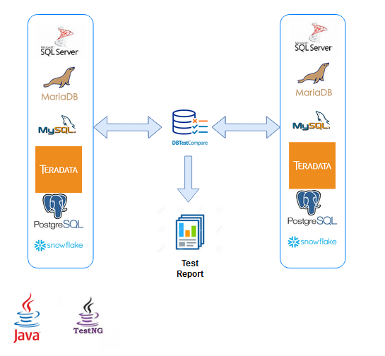

**Application to compare results of two SQL queries** 

[](https://dev.azure.com/DBTestCompare/Build/_build?definitionId=1&_a=summary)
[](https://dev.azure.com/DBTestCompare/Build/_build?definitionId=1&_a=summary)


It **reads tests definitions in XML** format form [specified directory](https://github.com/ObjectivityLtd/DBTestCompare/tree/master/test-definitions) and than runs them (as TestNG test). 

**You can generate automated tests for your database using [DBTestCompareGenerator](https://github.com/ObjectivityLtd/DBTestCompareGenerator)**

If two SQL returns different results -> test fails. 

Application [supports TeamCity](https://github.com/ObjectivityLtd/DBTestCompare/wiki/Real-time-test-execution-progress-in-TeamCity) Service Messages ([##teamcity messages](https://confluence.jetbrains.com/display/TCD8/Build+Script+Interaction+with+TeamCity)) so if teamcityLogsEnabled is set to "true" (config file or command line parameter), you will see nice test tree in TeamCity logs.

To execute tests run program (Java 8 must be installed first (JDK or JRE)):

If you set JAVA_HOME variable:
```
java -jar DBTestCompare-1.0-SNAPSHOT-jar-with-dependencies.jar
```
or to add automatically all drivers from the directory to the classspath (jdbc_drivers/*)
Windows
```
java -cp "DBTestCompare-1.0-SNAPSHOT-jar-with-dependencies.jar;jdbc_drivers/*" uk.co.objectivity.test.db.RunTests
```
Linux
```
java -cp "DBTestCompare-1.0-SNAPSHOT-jar-with-dependencies.jar:jdbc_drivers/*" uk.co.objectivity.test.db.RunTests
```
or e.g.
```
"C:\Program Files\Java\jdk1.8.0_92\bin\java" -jar DBTestCompare-1.0-SNAPSHOT-jar-with-dependencies.jar
```

The application provides the following features:
- **Platform independence** - possibility to run on Windows and Linux as well (Java Runtime Environment 8 needed)
- Supports **all databases with JDBC drivers provided** (tested with Microsoft SQL Server, Teradata, Snowflake, PostgreSQL and MySQL\MariaDB)
- Supports **all Continuous Integration tools** thanks to TestNG Java unit test framework
- Possibility to compare data between **two different database engines** even for huge data sets 
without "Out of memory problem" thanks to an incremental solution, more details [here](https://github.com/ObjectivityLtd/DBTestCompare/wiki/Fetch)
- Possibility to compare query to **expected data defined in csv file** and generate **Excel test report**, more details [here](https://github.com/ObjectivityLtd/DBTestCompare/wiki/KEY)
- Possibility to compare data in **one database engine in the fastest way** using MINUS/EXCEPT Sql operator, more details [here](https://github.com/ObjectivityLtd/DBTestCompare/wiki/Minus)
- **No need to compile program** in order to add new tests - thanks to Test Adapter DataDriven mechanism from TestNG 
- Possibility to **execute tests in parallel** by setting Threads parameter in the connection file.
- Possibility to build **multilevel tests structure**
- Possibility to **save query results to flat files**
- Real-time test execution progress in **TeamCity**, more details [here](https://github.com/ObjectivityLtd/DBTestCompare/wiki/Real-time-test-execution-progress-in-TeamCity)
- Possibility to store Queries in **separated files or inline** in xml test definitions, more details [here](https://github.com/ObjectivityLtd/DBTestCompare/wiki/Storing-queries-in-separated-files-or-inline-in-xml-test-definitions)
- **Connection pool** used for executing tests - connections to databases are not closed 
after each tests, but when all tests are finished
- Possibility to compare query to **expected data defined in csv file**, more details [here](https://github.com/ObjectivityLtd/DBTestCompare/wiki/FILE)
- Possibility to compare query to **expected number of rows** defined in XML test definition, more details [here](https://github.com/ObjectivityLtd/DBTestCompare/wiki/NMB_OF_RESULTS)
- Possibility to **choose exit code** in case  of test failure
- Possibility to **connect to OLAP - compare mdx queries**, more details [here](https://github.com/ObjectivityLtd/DBTestCompare/wiki/OLAP)
- Possibility to define **"delta"** precision of comparing floating-point numbers
- Possibility to **filter tests** for execution by including or excluding, more details [here](https://github.com/ObjectivityLtd/DBTestCompare/wiki/Filtering-tests-for-execution-by-including-or-excluding)
- Standard **TestNG html test report** in "test-output" folder, more details [here](https://github.com/ObjectivityLtd/DBTestCompare/wiki/Test-results---TestNG-html-report-in-%22test-output%22-folder)

### How DBTestCompare works:

Comparing databases:



With test data delivered by file:


The program searches for test definitions by default in folder "test-definitions".

JDBC drivers must be present in "jdbc_drivers" folder.
Licensed database drivers are NOT included, only open source like MySQL, MariaDB and PostgreSQL. 
Download licensed database drivers from the producer of the database e.g. Microsoft and put them in "jdbc_drivers" folder (on the same level as *.jar file). 

More details [here](https://github.com/ObjectivityLtd/DBTestCompare/wiki/Deploying-licensed-jdbc-drivers-(not-open-source))

You can override some of the application configuration properties, run app with:

 -DtestsDir=path             -set tests directory (default: test-definitions)
 
 -DteamcityLogsEnabled=true  -log test output in TeamCity format
 
 -DfilterInclude=a.b,g.z.f   -comma separated directories or test files which you want to include
 
 -DfilterExclude=a.b.test    -comma separated directories or test files which you want to exclude

for example:

```
java -DtestsDir=my_tests -jar DBTestCompare-1.0-SNAPSHOT-jar-with-dependencies.jar
```
More details [here](https://github.com/ObjectivityLtd/DBTestCompare/wiki/Command-line-parameters)

3'rd party libraries:
Software:
- SIROCCO :: Text Table Formatter
- Apache Log4j
- com.sun.xml.bind :: JAXB Runtime
- com.mchange :: c3p0 - a JDBC Connection pooling / Statement caching library

More details [here](https://github.com/ObjectivityLtd/DBTestCompare/blob/master/LICENSE-3RD-PARTY)

#### Where to start?
-------------
- See [Getting started](https://github.com/ObjectivityLtd/DBTestCompare/wiki/Getting-started).

Checkout the code or get compiled jar file from [releases page](https://github.com/ObjectivityLtd/DBTestCompare/releases)

-------------

To compile app to a runnable fat jar file, run (Maven must be installed first):
```
mvn clean compile assembly:single
```
jar will be created in target directory.

-------------

You can manage the application by attached ANT (ANT must be installed first) build.xml file (in folder \deploy), the script allows to :

-compile app

-replace tokens in connection definition  

-replace tokens in SQL queries

more details [here](https://github.com/ObjectivityLtd/DBTestCompare/wiki/Compiling,-replacing-tokens-in-connection-definition) and  [here](https://github.com/ObjectivityLtd/DBTestCompare/wiki/Replacing-tokens-in-SQL-queries)
